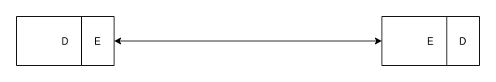
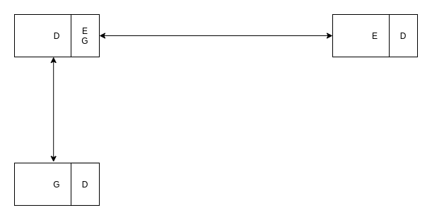
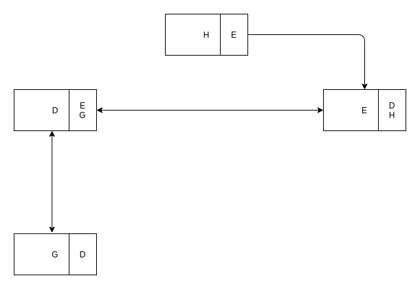
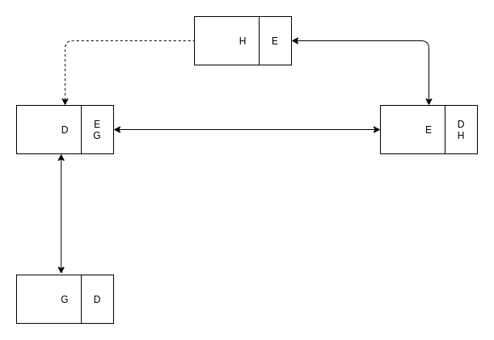
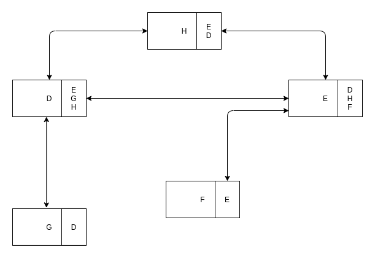
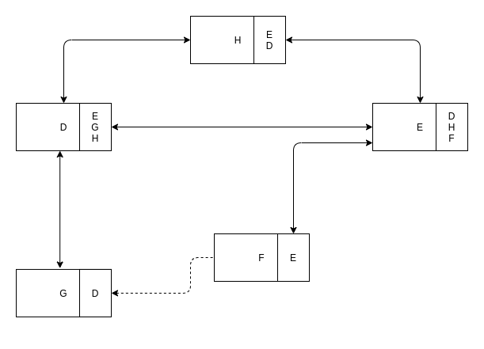
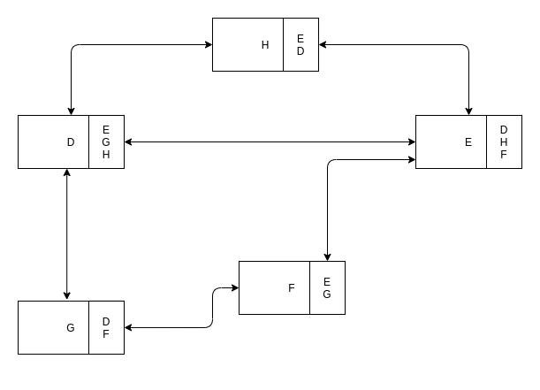

# CA-2021-part2

## Objectif

Mise en place d'un réseau social de confiance avec les fonctionnalités suivantes:
- Ajouter une utilisateur à partir d'un autre
- Se connecter à un utilisateur
- S'échanger les clés publiques entre utilisateurs

## Utilisation du programme

- Initialisation du réseau social de confiance
  ```sh
  $ ./main.py init <user1> <user2>
  ```
- Nettoyage du programme
  ```sh
  $ ./main.py clean
  ```
- Ajout d'un utilisateur dans le réseau social
  ```sh
  $ ./main.py add <user> <parrain>
  ```
- Demande de connexion d'un utilisateur 
  ```sh
  $ ./main.py connect <demandeur> <demandé>
  ```

## Scénario

```sh
$ ./main.py init D E
```

1. Création de l'utilisateur root
2. Ajout des utilisateurs D et E à partir de l'utilisateur root
3. Suppression de l'utilisateur root

```sh
$ ./main.py add G D
```

1. Création de l'utilisateur G à partir de l'utilisateur D

```sh
$ ./main.py add H E
```

1. Création de l'utilisateur H à partir de l'utilisateur E

```sh
$ ./main.py connect H D
```

1. H fait une demande de connexion à D et lui envoit sa clé publique
2. D vérifie dans sa liste d'amis si il connait H
2.1 Si oui, ils sont déjà amis
2.2 Sinon, D demande à sa liste d'amis (E, G) si ils connaissent H et joint à sa demande sa clé publique
3. E connaissant H, celui-ci transmet à D la signature de la clé publique de D ainsi que la clé publique de H
4. D vérifie la clé publique de H reçue de E et celle reçue de H
4.1 Si elles sont différentes, D refuse la demande de connexion
4.2 Sinon, D stocke la clé publique de H et transmet sa clé publique ainsi que la signature de celle-ci à H
5. H stocke la clé publique de D si la signature de celle-ci est vérifiée

```sh
$ ./main.py add F E
```

1. Ajout de l'utilisateur F à partir de l'utilisateur E

```sh
$ ./main.py connect F G
```

1. F fait une demande de connexion à G et lui envoit sa clé publique
2. G vérifie dans sa liste d'amis si il connait F
2.1 Si oui, ils sont déjà amis
2.2 Sinon, G demande à sa liste d'amis (D) si ils connaissent F et joint à sa demande sa clé publique
3. D vérifie dans sa liste d'amis si il connait F
3.1 Si oui, ils sont déjà amis
3.2 Sinon, D demande à sa liste d'amis (E, G et H) si ils connaissent F et joint à sa demande la clé publique de G
4. E connaissant F, celui-ci transmet à D la signature de la clé publique de G ainsi que la clé publique de F
5. D reçoit la signature et la clé publique de F et le transmet à G (selon la liste de transmission)
6. G vérifie la clé publique de F reçue de D et celle de F
6.1 Si elles sont différentes, G refuse la demande de connexion
6.2 Sinon, G stocke la clé publique de F et transmet sa clé publique ainsi que la signature de celle-ci à F
7. H stocke la clé publique de D si la signature de celle-ci est vérifiée

> Le chemin passant par H est ignoré par notre algorithme de recherche car, afin d'éviter les boucles et d'avoir le chemin le plus court, nous stockons les utilsateurs par lesquels nous sommes déjà passés.
 
### Etat final

